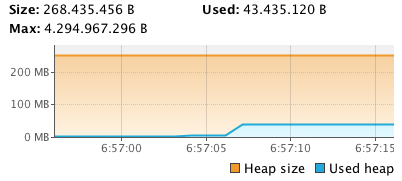
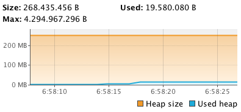

theme: Plain Jane
autoscale: true

# Core Java APIs

---

## String concatenation

1. both operands numeric, `+` means __addition__
1. either operand a STring, `+` means concatenation
	1. operands gets promoted into String
1. expression evaluated from left --> right

---

## String concatenation

```java
String s1 = 1 + 3 + "j";    // "4j"
String s2 = "1" + 3.0;      // 13.0
String s3 = 1 + 2.5 + "€";  // 3.5€

String s4 = 1 + "" + 1;		// ?
String s5 = 1 + 2 + 3;		// ?
String s6 = null + 1;		// ?
```

---

## Strings are inmutable

- inmutable: can't change once created
- final: can't be made mutable by inheritance

```java
String s = "Hello";
s = "goodbye";		// original "Hello" object released

```

--- 

## Creating my own inmutable classes


```java
final class Person {
    private String name;
    
    Person(String name) {
        this.name = name;
    }

    public String getName() {
        return name;
    }
}

// after that code...

Person diego = new Person("Diego");
diego.getName();
// setName() doesn't exists
```

---

## Creating my own inmutable classes

```java
// v2, with "setter"

final class Person {
    private String name;

    Person(String name) {
        this.name = name;
    }

    public String getName() {
        return name;
    }
    
    public Person setName(String name) {
        return new Person(name);
    }
}
```

---

## Inmutable for what?

- Parsing JSON / XML objects just read from the net
- Using global settings in my app I don't want to change
- In general, avoiding mutable state Is A Good Thing

---

## Watch out!

```java
String s = "hello";
String s1 = s.concat(" Mary Lou");
s.concat(" goodbye heart");
System.out.println(s1);
System.out.println(s);
```

---

## Strings & the String pool

```java 

String s = "Hello";
String s1 = new("Hello");

```

---

## Memory test

```java

System.out.println("start");
try {
	Thread.sleep(3000);			// 3 sec delay
} catch (InterruptedException e) {
	e.printStackTrace();
}

System.out.println("lets go!");
List<String> list = new ArrayList<>(100000);
for (int i = 0; i< 1000000; i++) {
	String s = "number";	// change for String s = new String("number");
	list.add(s);
}

try {
	Thread.sleep(10000);		// 10 sec delay
} catch (InterruptedException e) {
	e.printStackTrace();
}
```

---

## jvisualvm

- Comes for free with JDK
- in your $JAVA_HOME
- http://visualvm.java.net/download.html




---

## String methods

- length
- charAt
- indexOf
- substring
- toLowerCase / toUpperCase
- equals / equalsIgnoreCase
- startsWith / endsWith
- contains
- replace
- trim

---

## StringBuilder

- mutable String
- good for concat Strings
- good for the GC / memory fragmentation

```java

StringBuilder s = new StringBuilder("Apple Google Microsoft");
System.out.println(s);
System.out.println(s.charAt(3));
s.append(" Yahoo!");
System.out.println(s);

```

---

## Typical SQL statement

```java

String query = "Select ( " + id + ", " + name + " ) from " + table + 
			   " where " + id + " = " + theId;

```

- at least 10 String objects...
- now 1000 customers connect to this page...
- 10000 objects in memory...

---

## StringBuilder vs StringBuffer

- StringBuffer: old, Thread safe
- StringBuilder: shiny, shiny, new, not Thread safe, use this

---

## Equality (== vs equals)

- Sirve para ver la igualdad lógica entre dos objetos
- Object.equals compara referencias (es idéntico a ==)
- Podemos sobreescribirlo
- Sin equals no podemos usar estos objetos como Key en HashTable


```java

@Override
public boolean equals(Object obj) {	// OJO: se recibe un Object
	if (obj instanceof Person2 && ((Person2)obj).getName().equals(getName()) ) {
			return true;
	}
	return false;
}


```
---

## Equals contract

- reflexivo: x.equals(x) debe devolver true
- simétrico: x.equals(y) <---> y.equals(x)
- transitivo: x.equals(y) --> true, y.equals(z) --> true ==> x.equals(z) --> true
- consistente: si x.equals(y) devuelve true y no cambiamos nada, múltiples invocaciones devuelven siempre lo mismo
- x.equals(null) --> false (con x no null)

---

## equals - hashcode contract

- Si dos objectos se consideran iguales mediante equals, deben devolver el mismo hash code value
- Invocaciones sucesivas sobre un mismo objeto que no cambiamos deben devolver el mismo valor
- NO es obligatorio que si dos objetos no son iguales (equals) deban devolver hash codes distintos: pueden devolver siempre el mismo

---

## Arrays

- definition / instantiation

```java

// good 
int[] a1 = new int[10];
int a2[] = new int[10];
Integer ai[] = new Integer[10];

// bad

int a3[10] = new int[10];
int a4[] = new int[];
int a5[10] = new int[];
int a6[] = new int[]();
int a6[] = new int(10);


```

- memory (when using reference types)

---

## Arrays: sorting / searching

- Sorting

```java

Integer ai[] = {4, 1, 3};
Arrays.sort(ai);

for (int i: ai) {
    System.out.println(i);
}


```

---


## Arrays: sorting watch out 

```java

String ai[] = {"4", "11", "03", "1", "100"};
Arrays.sort(ai);

for (String i: ai) {
    System.out.println(i);
}


// output:
03
1
100
11
4
```

---

## Arrays: search

- can only search a sorted array

```java
int ai[] = {1, 7, 24, 32};
Arrays.sort(ai);

System.out.println(" * " + Arrays.binarySearch(ai, 11));
System.out.println(" * " + Arrays.binarySearch(ai, 24));

```


---

## Varargs java

(seen in chap 4)

---

## Multidimensional arrays

---

## ArrayList

- import java.util.*
- creating an ArrayLIst
- add()
- remove()
- set()
- isEmpty(), size()
- clear()
- contains()
- equals(): same elements in the same order

---


## Wrapper classes

- to convert values between types
- to have collections of simple values


---

## Boxing / Unboxing


--- 

## Date and Time

(See file)